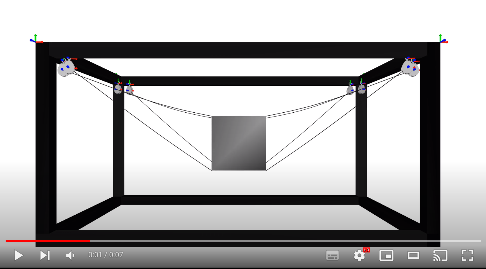

# XXL Robotics


Platform held by eight cables. 

[](https://youtu.be/0vbUbMCwXpM)


## Installation


### Required

The simulations are done using the simulation framework [SOFA](https://www.sofa-framework.org/). Binaries of SOFA with the required and optional plugins are available [here](https://github.com/SofaDefrost/TIRREX/releases). If you compile SOFA, checkout the following source code:

- [SOFA](https://github.com/sofa-framework/sofa) on branch master
- [SofaPython3](https://github.com/sofa-framework/SofaPython3) plugin for SOFA on branch master
- [Cosserat](https://github.com/SofaDefrost/Cosserat) plugin on branch master
- [BeamAdapter](https://github.com/sofa-framework/BeamAdapter) plugin on branch master
- [SoftRobots](https://github.com/SofaDefrost/SoftRobots) plugin on branch master
- [STLIB](https://github.com/SofaDefrost/STLIB) plugin on branch master 

In the CMake GUI also enable the following plugins:

- ArticulatedSystemPlugin
 
### Optional 

- [SoftRobots.Inverse](https://github.com/SofaDefrost/SoftRobots) plugin for SOFA to solve the inverse kinematics of the robot
- [tkinter](https://docs.python.org/fr/3/library/tkinter.html), GUI to pilot the cables. This package is distributed by default with python on MacOS and Windows.

## How to

Run the simulation. In a terminal:

```bash
~$ cd TIRREX.XXL
~/TIRREX.XXL$ runSofa scene.py 
~/TIRREX.XXL$ runSofa sceneInverseKinematics.py  # for inverse resolution
```

## Features


### Parameters

The geometric and mechanical parameters can be changed from the file `params.py`.


## To do

- [ ] Merge Karim's work on pulleys  


## Authors


Eulalie Coevoet & Karim Moussa
