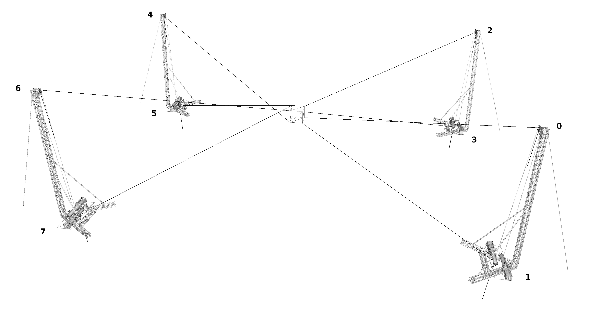

# XXL Robotics


Platform held by eight cables. 

[](https://youtu.be/0vbUbMCwXpM)


## Installation


### Required

The simulations are done using the simulation framework [SOFA](https://www.sofa-framework.org/). Binaries of SOFA with the required and optional plugins are available [here](https://github.com/SofaDefrost/TIRREX/releases). If you compile SOFA, checkout the following source code:

- [SOFA](https://github.com/sofa-framework/sofa) on branch master
- [SofaPython3](https://github.com/sofa-framework/SofaPython3) plugin for SOFA on branch master
- [Cosserat](https://github.com/SofaDefrost/Cosserat) plugin on branch master
- [BeamAdapter](https://github.com/sofa-framework/BeamAdapter) plugin on branch master
- [SoftRobots](https://github.com/SofaDefrost/SoftRobots) plugin on branch master
- [STLIB](https://github.com/SofaDefrost/STLIB) plugin on branch master 

In the CMake GUI also enable the following plugins:

- ArticulatedSystemPlugin
 
### Optional 

- [SoftRobots.Inverse](https://github.com/SofaDefrost/SoftRobots) plugin for SOFA to solve the inverse kinematics of the robot
- [tkinter](https://docs.python.org/fr/3/library/tkinter.html), GUI to pilot the cables. This package is distributed by default with python on MacOS and Windows.

## How to

Run the simulation. In a terminal:

```bash
~$ cd TIRREX.XXL
~/TIRREX.XXL$ runSofa scene.py 
~/TIRREX.XXL$ runSofa sceneInverseKinematics.py  # for inverse resolution
```

## Features


### Parameters

The geometric and mechanical parameters can be changed from the file `params.py` (for global changes), 
or directly in the scene file (for local changes):

```python
def createScene(rootnode):
    from scripts.utils.header import addHeader, addSolvers

    params = Parameters()
    params.structure.height = 9.5
    params.structure.width = 1
    params.structure.length = 27.78
    params.structure.thickness = 0

    params.cable.nbSections *= 3
    params.cable.length *= 3

    # Orientation of each pulley in radian
    params.structure.pulleysorientations = [0, 0, 0, 0,
                                            0, 0, 0, 0]

    # Position of the pulley on the structure ('up' or 'down')
    params.structure.pulleysUD = ["up", "down", "up", "down",
                                  "up", "down", "up", "down"]

    # For each pulley, connect the cable to the corresponding corner of the platform
    # (see the README.md for the corresponding numbering)
    params.structure.cornersOrder = [2, 3, 1, 0, 6, 7, 5, 4]

    settings, modelling, simulation = addHeader(rootnode)
    addSolvers(simulation, firstOrder=False, rayleighStiffness=0.2)
    rootnode.VisualStyle.displayFlags = "showInteractionForceFields showCollisionModels"

    system = System(modelling, simulation, cableModel='beam')
    for i, cable in enumerate(system.cables.children):
        cable.RigidBase.addObject('RestShapeSpringsForceField', points=[0], stiffness=1e12)

```

Numbering of the pulleys, and corners of the platform follows the image bellow : 

<body>

</body>

## To do

- [ ] Merge Karim's work on pulleys  


## Authors


Eulalie Coevoet & Karim Moussa
